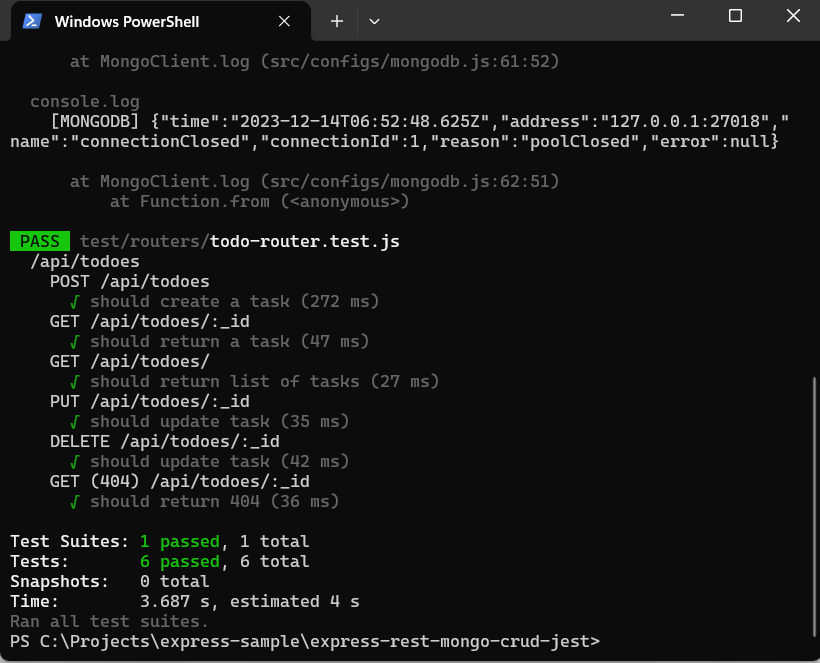

#   Buat Tes Integrasi Untuk Operasi CRUD Dengan Expressjs, Mongodb Dan JEST

Postingan ini lanjutan dari postingan [Membangun Aplikasi CRUD Dengan Expressjs dan Mongodb](https://marmeam.com/post/express-rest-mongodb-crud). Pada postingan ini akan menunjukkan cara membuat tes integrasi dengan menggunakan JEST.

##  Persyaratan

1.  [Node](https://nodejs.org/en)
1.  [Mongodb](https://www.mongodb.com/)
1.  [Docker](https://www.docker.com/)
1.  [VisualStudioCode](https://code.visualstudio.com/)

##  Referensi

1.  [Express](https://expressjs.com/en/starter/installing.html)
1.  [Express & MongoDB](https://www.mongodb.com/compatibility/express)
1.	[mongodb-memory-server](https://github.com/nodkz/mongodb-memory-server)
1.  [JEST](https://jestjs.io/docs/getting-started)
1.  [supertest](https://github.com/ladjs/supertest#readme)

##  Siapkan Proyek

Salin kode dari [https://github.com/ferrylinton/express-sample/tree/main/express-rest-mongo-crud](https://github.com/ferrylinton/express-sample/tree/main/express-rest-mongo-crud).

Masuk ke dalam folder kode dan instal librari

```console
npm i express mongodb cross-env
npm i -D mongodb-memory-server@7.6.3 jest supertest
```

##  Buat Variable Untuk Pengetesan

Ubah berkas ***src\configs\mongodb.js*** dan ubah nilai PORT ke kode berikut.

```js
const MONGODB_PORT = process.env.NODE_ENV === 'test' ? "27018" : "27017";
```

Untuk pengetesan, mongoclient akan membuka koneksi di port **27018**

##  Siapkan ***<u>mongodb-memory-server</u>*** Untuk Pengetesan

Buat berkas ***test\libs\mongo-test-util.js*** dan tambahkan kode berikut

```js
const { MongoMemoryServer } = require('mongodb-memory-server');
const { getMongoClient } = require('../../src/configs/mongodb');

// Buat instansi MongoMemoryServer
const mongoServer = new MongoMemoryServer({
	instance: {
		port: 27018
	},
	auth: {
		enable: true,
		extraUsers: [{
			createUser: "admin",
			pwd: "password",
			roles: [{
				role: "root",
				db: "admin"
			}],
			database: "admin"
		}]
	}
});

// Memulai MongoMemoryServer
exports.startMongoServer = async () => {
	try {
		await mongoServer.start(true);
		console.log(`mongoServer starting on ${mongoServer.getUri()}`);
	} catch (error) {
		console.log(error);
	}
};

// Hentikan MongoMemoryServer
exports.stopMongoServer = async () => {
	try {
		const connection = await getMongoClient();
		if (connection) {
			// Tutup klien dan koneksi
			connection.close();
		}

		await mongoServer.stop();
	} catch (error) {
		console.log(error);
	}
};
```

Deskiripsi: 

-   **instance**:

    -   **port: 27018**
        
        MongoMemoryServer akan berjalan pada port 27018

-   **auth**:

    -   **enable: true**

        Aktifkan pembuatan pengguna di MongoMemoryServer

    -   **extraUsers: [{
			createUser: "admin",
			pwd: "password",
			roles: [{
				role: "root",
				db: "admin"
			}],
			database: "admin"
		}]**

        Tambahkan pengguna baru ke database **admin**.

##  Buat Tes Integrasi

Buat berkas ***test\routers\todo-router.test.js*** dan tambahkan kode berikut.

```js
const assert = require('assert');
const request = require('supertest');
const app = require('../../src/app');
const { startMongoServer, stopMongoServer } = require('../libs/mongo-test-util');

beforeAll(async () => {
    await startMongoServer();
});

afterAll(async () => {
    await stopMongoServer();
});

describe('/api/todoes', () => {

    let _id = '0';

    describe('POST /api/todoes', function () {

        it('should create a task', async function () {
            const response = await request(app)
                .post('/api/todoes') 
                .send({ task: 'test' })
                .set('Accept', 'application/json')
                .expect(201); 

            _id = response.body.insertedId;
            assert(response.body.acknowledged, true);
        });

    });

    describe('GET /api/todoes/:_id', function () {

        it('should return a task', async function () {
            const response = await request(app)
                .get('/api/todoes/' + _id)
                .set('Accept', 'application/json')
                .expect(200);
            assert(response.body._id, _id);
        });

    });

    describe('GET /api/todoes/', function () {

        it('should return list of tasks', async function () {
            const response = await request(app)
                .get(`/api/todoes`)
                .set('Accept', 'application/json')
                .expect(200);
            assert(response.body.length, 1);
        });

    });

    describe('PUT /api/todoes/:_id', function () {

        it('should update task', async function () {
            const response = await request(app)
                .put('/api/todoes/' + _id)
                .send({ task: 'test update' })
                .set('Accept', 'application/json')
                .expect(200);
            assert(response.body.modifiedCount, 1);
        });

    });

    describe('DELETE /api/todoes/:_id', function () {

        it('should update task', async function () {
            const response = await request(app)
                .delete('/api/todoes/' + _id)
                .set('Accept', 'application/json')
                .expect(200);
            assert(response.body.deletedCount, 1);
        });

    });

    describe('GET /api/todoes/:_id', function () {

        it('should return 404', async function () {
            await request(app)
                .get('/api/todoes/' + _id)
                .set('Accept', 'application/json')
                .expect(404);
        });

    });

})
```

##  Tambahkan Skrip Untuk Testing

Ubah berkas ***package.jsons*** dan tambahkan skrip ini

```json
"test": "cross-env NODE_ENV=test jest --runInBand --detectOpenHandles --forceExit"
```
Deskripsi :

1.  **cross-env NODE_ENV=test** : mebuat variabel process.env.NODE_ENV = 'test'

1.  **jest** : menjalankan proses pengetesan
    -  **--forceExit** : memaksa Jest untuk keluar setelah semua tes selesai dijalankan
    -  **--runInBand** : jalankan semua tes secara serial dalam proses saat ini
    -  **--detectOpenHandles** : mencoba mengumpulkan dan mencetak operasi yang mencegah Jest keluar dengan bersih

##  Jalankan Tes Integrasi

```console
npm test
```

Hasil :



##  Kode

::: github
[https://github.com/ferrylinton/nodejs-sample/tree/main/express-rest-mongodb-crud-jest](https://github.com/ferrylinton/nodejs-sample/tree/main/express-rest-mongodb-crud-jest)
:::

::: post-navigation
[Membangun Aplikasi CRUD Dengan Expressjs Dan Mongodb](/post/express-rest-mongodb-crud "sebelumnya")
:::