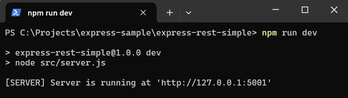
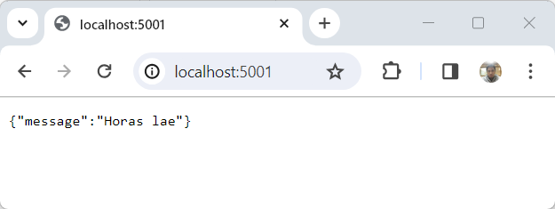

#   Create Simple Express Rest App

ExpressJS is a web application framework for node applications and the most popular. Here's how to create a simple application with ExpressJS.

##  Requirement

1.  [Node](https://nodejs.org/en)
1.  [VisualStudioCode](https://code.visualstudio.com/)

##  Reference

1.  [Express](https://expressjs.com/en/starter/installing.html)

##  Create Node Application

```console
mkdir express-rest-simple
cd express-rest-simple
npm init --yes
```
##  Install Libraries

```console
npm i express cors helmet
```

Description :
-   [express](https://expressjs.com/) : Fast, unopinionated, minimalist web framework for Node.js
-   [cors](https://github.com/expressjs/cors#readme) : Enable CORS (Cross-Origin Resource Sharing).
-   [helmet](https://helmetjs.github.io/) : Helmet helps secure Express apps by setting HTTP response headers.

##  Open generated code with Visual Studio Code

```console
code .
```

##  Add Simple Code

1.  Add file ***src\routers\index-router.js***
    
    This file contains simple code of REST API, to display simple json data

    ```js
    const express = require('express');

    /**
    * Create new Router
    */
    const router = express.Router();

    // Register request to endpoint with GET method
    router.get('/', (req, res) => {
        res.status(200).json({ message: "Horas lae", NODE_ENV: process.env.NODE_ENV });
    });

    module.exports = router;
    ```

1.  Add ***src\app.js*** file

    This file contains instance of express application

    ```js
    const express = require('express');
    const helmet = require('helmet');
    const cors = require('cors');
    const indexRouter = require('./routers/index-router');

    /**
    * Creates an Express application
    */
    const app = express();

    // helmet helps secure Express apps by setting HTTP response headers
    app.use(helmet());

    // enable CORS
    app.use(cors({ origin: '*' }));

    // parses incoming requests
    app.use(express.json());
    app.use(express.urlencoded({ extended: true }));

    // map router to express application
    app.use('/', indexRouter);

    // 404 / not found handler
    app.use((req, res, next) => {
        res.status(404).json({ message: "Not Found" })
    })

    // error handler
    app.use((err, req, res, next) => {
        console.error(err.stack)
        res.status(500).json({ message: err.message })
    })

    module.exports = app;
    ```

1.  Add ***src\server.js*** file

    This file contains code will start a server and listens on port 5001 for connections

    ```js
    const app = require('./app');
    
    /**
     * @constant {number} express application running on this port number
    */
    const PORT = 5001;

    /**
    * This function is called after the Express application runs
    */
    const callback = () => {
        console.log(`[SERVER] Server is running at 'http://127.0.0.1:${PORT}'`);
    };

    /**
    * This function is the first function to be executed to start Express application.
    */
    const main = () => {
        try {
            // this code start express app
            app.listen(PORT, "0.0.0.0", callback);
        } catch (error) {
            //The application will stop if there is an error
            console.log(error);
            process.exit();
        }
    };

    // Execute main() function
    main();
    ```

1.  Start Express Application

    Modify ***package.json*** file, and add this script

    ```json
    "scripts": {
		"dev": "node src/server.js"
	}
    ```
    Run this script

    ```console
    npm run dev
    ```

    Result

    
    
    Check on browser

    


##  Source Code

::: github
[https://github.com/ferrylinton/express-sample/tree/main/express-rest-simple](https://github.com/ferrylinton/express-sample/tree/main/express-rest-simple)
:::

::: post-navigation
[Building CRUD Application With Expressjs and Mongodb](/post/express-rest-mongodb-crud "next")
:::