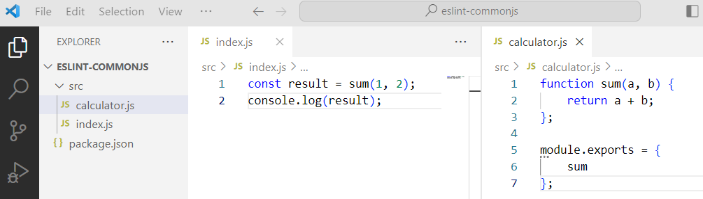
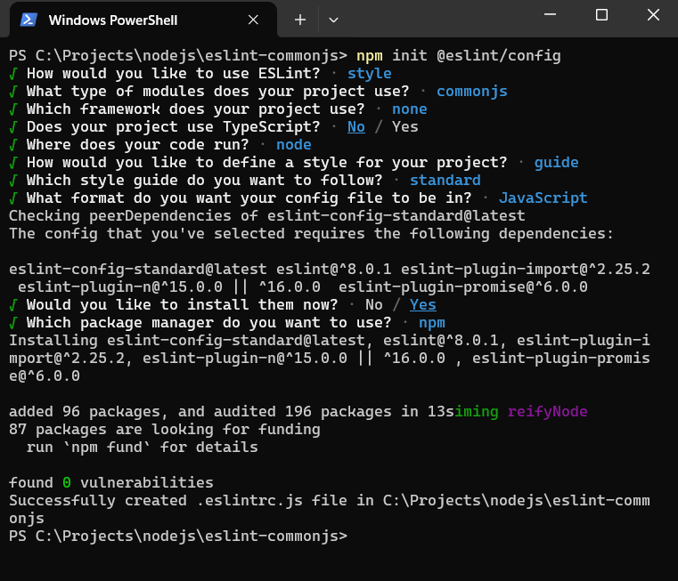
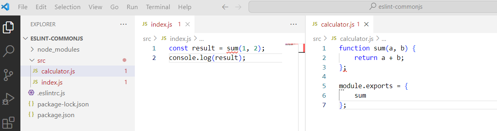
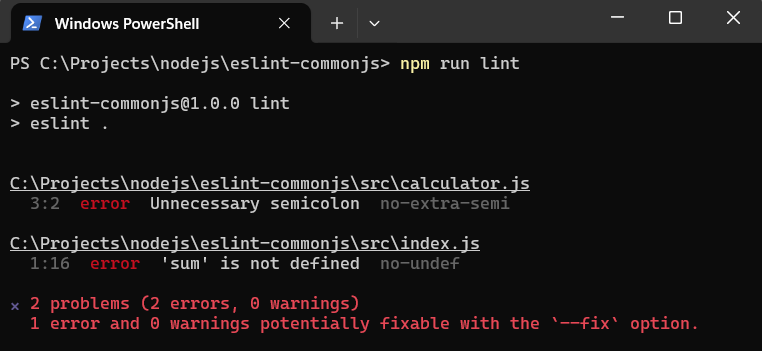

#   Setup Node Application With Eslint (Common JS)

Visual Studio Code is the most widely used IDE for creating node applications. Node applications can be written with CommonJS module or ECMAScript module. If node application is written with CommonJS module, Visual Studio Code cannot yet pinpoint all the errors in the code without the help of ESLint. This post will show you how to set up ESLint into a node application and Visual Studio Code.

##  Requirement

1.  [Node](https://nodejs.org/en)
1.  [Visual Studio Code](https://code.visualstudio.com/)

##  Reference

1.  [NodeJS](https://nodejs.org/api/modules.html)
1.  [ESLint](https://eslint.org/docs/latest/use/getting-started)

##  Create Simple Node Application

1.  Create folder ***eslint-commonjs*** (or your project name)

	```console
	mkdir eslint-commonjs
    cd eslint-commonjs
	```

1.  Initialize node application

    ```console
    npm init --yes
    ```

1.  Open generated code with Visual Studio Code.

    ```console
    code .
    ```

##  Add Simple Code

1.  Created ***src\calculator.js*** file and add the following code.

    The code is a simple function to sum 2 numbers.

    ```js
    function sum(a, b) {
        return a + b;
    };

    module.exports = {
        sum
    };
    ```

1.  Create ***src\index.js*** file and add the following code.

    This code call ***sum*** method from ***src\calculator.js*** file.

    ```js
    const result = sum(1, 2);
    console.log(result);
    ```
    The code is incorrect because the ***sum*** function has not been defined, but Visual Studio Code does not show any errors.

    

    
1.  Run ***src/index.js*** file.

    ```console
    node src/index.js
    ```
    Result will show error because the code is incorrect.

    ```console
    const result = sum(1, 2);
               ^

    ReferenceError: sum is not defined
        at Object.<anonymous> (C:\Projects\nodejs\eslint-commonjs\src\index.js:1:16)
        at Module._compile (node:internal/modules/cjs/loader:1159:14)
        at Module._extensions..js (node:internal/modules/cjs/loader:1213:10)
        at Module.load (node:internal/modules/cjs/loader:1037:32)
        at Module._load (node:internal/modules/cjs/loader:878:12)
        at Function.executeUserEntryPoint [as runMain] (node:internal/modules/run_main:81:12)
        at node:internal/main/run_main_module:23:47
    ```

##  Setup Eslint

1.  Run this script

    ```console
    npm init @eslint/config
    ```

    Choose these configuration

    

1.  Modify ***.eslintrc.js*** file, add this code.

    ```js
    module.exports = {
        env: {
            commonjs: true,
            node: true,
            es6: true,
            jest: true,
        },
        extends: ['eslint:recommended'],
        overrides: [
            {
                files: ['.eslintrc.{js,cjs}', '**/*.test.js'],
                parserOptions: {
                    sourceType: 'script',
                }
            },
        ],
        parserOptions: {
            ecmaVersion: 'latest',
        },
        rules: {
            'no-unused-vars': 'warn',
            'no-var': 'warn',
            'prefer-const': 'warn',
        },
    };
    ```
1.  Install VS Code ESLint extension.

    

1.  Check code after ESLint setup.

    

    Visual Studio Code show errors.

1.  Modify ***package.json*** file and add this code.

    ```json
    {
        "name": "eslint-commonjs",
        "version": "1.0.0",
        "description": "Node Application With Eslint (Common JS)",
        "main": "src/index.js",
        "scripts": {
            "start": "node src/index.js",
            "lint": "eslint .",
                "lint:fix": "eslint . --fix"
        },
        "keywords": [
            "eslint",
            "node"
        ],
        "author": "Ferry L. H.",
        "license": "ISC",
        "devDependencies": {
            "eslint": "^8.54.0",
            "eslint-config-standard": "^17.1.0",
            "eslint-plugin-import": "^2.29.0",
            "eslint-plugin-n": "^16.3.1",
            "eslint-plugin-promise": "^6.1.1"
        }
    }
    ```
1.  Lint code

    ```console
    npm run lint
    ```
    Result will show errors

    

## Conclusion

After you complete these steps, with ESLint you can find the faulty code in Visual Studio Code, or by running a script.

## Source Code

[https://github.com/ferrylinton/nodejs-sample/tree/main/eslint-commonjs](https://github.com/ferrylinton/nodejs-sample/tree/main/eslint-commonjs)
