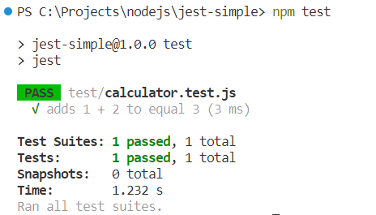

#   Contoh Sederhana JEST

Pengujian unit bertujuan untuk memeriksa sebagian kecil dari kode aplikasi, yang biasanya merupakan fungsi dalam kode aplikasi. Posting ini berisi contoh aplikasi node pengujian unit menggunakan Jest. Jest adalah Kerangka Pengujian JavaScript yang menyenangkan dan berfokus pada kesederhanaan.

##  Persyaratan

1.  [Node](https://nodejs.org/en)
1.  [Visual Studio Code](https://code.visualstudio.com/)

##  Referensi

1.  [NodeJS](https://nodejs.org/api/modules.html)
1.  [Jest](https://jestjs.io/docs/getting-started)
1.  [ESlint](https://eslint.org/docs/latest/use/getting-started)

##  Buat aplikasi Node

Lihat postingan berikut:

-   [Mempersiapkan Aplikasi Node Dengan Eslint (Common JS)](https://marmeam.com/post/eslint-commonjs-setup)
-   [Mempersiapkan Aplikasi Node Dengan Eslint dan Prettier (Common JS)](https://marmeam.com/post/eslint-prettier-commonjs-setup)

##  Setup JEST

1.  Instal Jest.

    ```console
    npm install jest eslint-plugin-jest --save-dev
    ```
1.  Ubah berkas ***.eslintrc.js***.

    ```js
    module.exports = {
		env: {
			commonjs: true,
			node: true,
			es6: true,
			jest: true,
		},
		extends: ['plugin:prettier/recommended', 'prettier', 'eslint:recommended'],
		overrides: [
			{
				files: ['.eslintrc.{js,cjs}', '**/*.test.js'],
				parserOptions: {
					sourceType: 'script',
				},
				plugins: ['jest'],
			},
		],
		parserOptions: {
			ecmaVersion: 'latest',
		},
		rules: {
			'prettier/prettier': 'warn',
			'no-unused-vars': 'warn',
			'no-var': 'warn',
			'prefer-const': 'warn',
		},
	};
    ```

1.  Ubah berkas ***package.json*** dan tambahkan kode berikut

    ```json
    {
		"name": "jest-simple",
		"version": "1.0.0",
		"description": "Simple Example of JEST (Common JS)",
		"main": " src/index.js",
		"scripts": {
			"start": "node src/index.js",
			"dev": "node src/index.js",
			"test": "jest",
			"lint": "eslint .",
			"lint:fix": "eslint . --fix",
			"format": "prettier . --write",
			"format:check": "prettier . --check"
		},
		"keywords": [
			"node",
			"eslint",
			"prettier",
			"jest"
		],
		"author": "ferrylinton",
		"license": "ISC",
		"devDependencies": {
			"eslint": "^8.54.0",
			"eslint-config-prettier": "^9.0.0",
			"eslint-config-standard": "^17.1.0",
			"eslint-plugin-import": "^2.29.0",
			"eslint-plugin-n": "^16.3.1",
			"eslint-plugin-prettier": "^5.0.1",
			"eslint-plugin-promise": "^6.1.1",
			"jest": "^29.7.0",
			"prettier": "3.1.0"
		}
	}
    ```
##	Buat Kode Sederhana

1.	Buat berkas ***src\calculator.js***, dan tambahkan kode berikut

	```js
	function sum(a, b) {
		return a + b;
	}

	module.exports = {
		sum
	};
	```

1.  Buat berkas ***jest-simple\test\calculator.test.js***, dan tambahkan kode berikut.

    ```js
    const { sum } = require('../src/calculator');

    // nama
    test('adds 1 + 2 to equal 3', () => { 

        // menjalankan fungsi yang akan diuji
        const result = sum(1, 2);  
        
        // periksa hasilnya
        expect(result).toBe(3);
            
    });
    ```
    Lihat **[NodeJS#testname-options-fn](https://nodejs.org/api/test.html#testname-options-fn)** untuk informasi lebih lanjut.


1.  Jalankan skrip tes, dan JEST akan menampilkan hasilnya.

    ```console
    npm test
    ```

    

## Kode

https://github.com/ferrylinton/nodejs-sample/tree/main/jest-simple