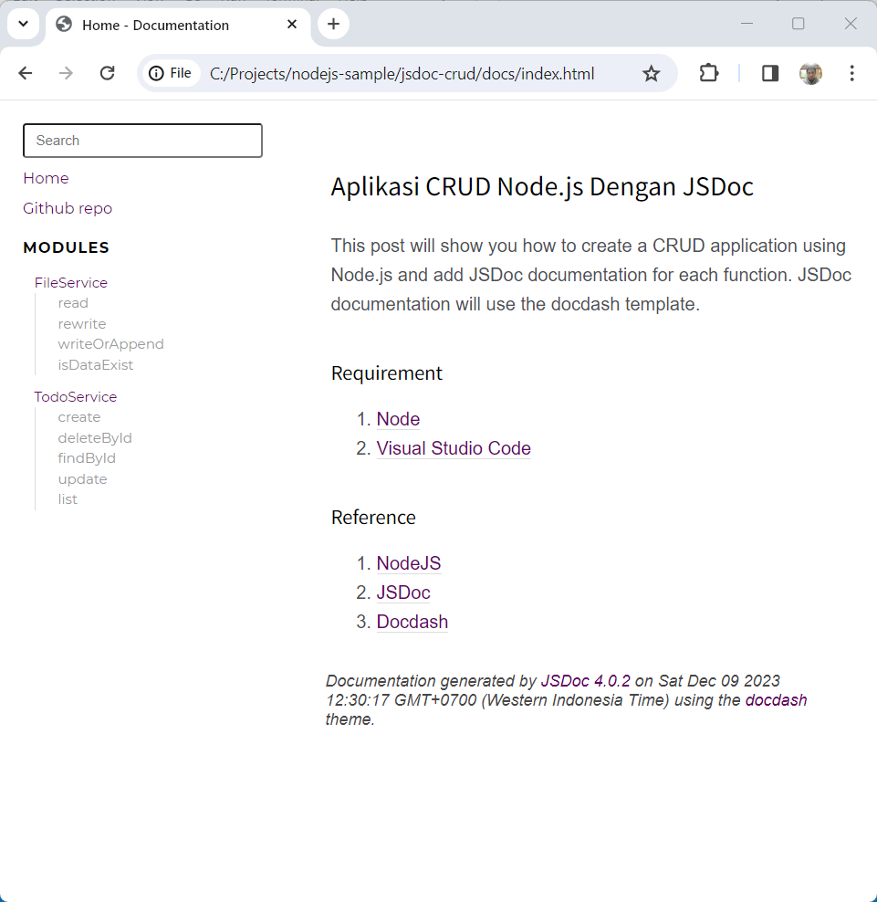

#   Aplikasi CRUD Node.js Dengan JSDoc

Postingan ini akan menunjukkan cara membuat aplikasi CRUD menggunakan Node.js dan menambahkan dokumentasi JSDoc disetiap fungsi. Dokumentasi JSDoc akan menggunakan template docdash.

##  Persyaratan

1. 	[Node](https://nodejs.org/en)
1. 	[Visual Studio Code](https://code.visualstudio.com/)

##  Referensi

1.  [NodeJS](https://nodejs.org/api/modules.html)
1.  [JSDoc](https://jsdoc.app/)
1.  [Docdash](https://clenemt.github.io/docdash/)
1.  [rimraf](https://github.com/isaacs/rimraf#readme)

##  Buat Aplikasi Node Dengan JSDoc

Lihat postingan ini : 
    
-   [Contoh Sederhana JSDoc](https://marmeam.com/post/jsdoc-simple)
-   [Contoh Sederhana JSDoc Dengan Docdash](https://marmeam.com/post/jsdoc-docdash)


##  Uabah berkas ***jsdoc.json***, dan tambahkan konfigurasi berikut

Berkas ini adalah berkas berisi konfigurasi JSDoc, periksa tautan ini https://jsdoc.app/about-configuring-jsdoc.

```json
    {
        "source": {
            "include": "src",
            "includePattern": ".js$"
        },
        "opts": {
            "template": "node_modules/docdash",
            "destination": "./docs/",
            "readme": "./readme.md",
            "recurse": true
        },
        "docdash": {
            "sort": true,
            "search": true,
            "menu": {
                "Github repo": {
                    "href": "https://github.com/ferrylinton/nodejs-sample/tree/main/jsdoc-crud",
                    "target": "_blank",
                    "class": "menu-item",
                    "id": "repository"
                }
            }
        }
    }
```
Deskripsi :

-   **"source"** :

    -   **"include"** : "src"
        
        Meng-generate dokumentasi untuk file-file yang ada di dalam folder ***src***

    -   **"includePattern"** : ".js$"

        Meng-generate dokumentasi untuk file-file dengan ekstensi ***.js***

-   **"opts"** :
    
    -   **"template"** : "node_modules/docdash"

        JSDoc akan menggunakan template ***docdash***

    -   **"destination"** : "./docs/"

        JSDoc akan dibuat di folder ***docs***

    -   **"readme"** : "./README.md"

        Konten ***README.md*** akan ditampilkan di halaman beranda JSDoc

    -   **"recurse"** : true

        Rekursi diaktifkan

-   **"docdash"** :

    -   **"sort"** : true

        Urutkan menu

    -   **"search"**: true

        Tambahkan bilah pencarian

    -   "**menu**":

        -   **"Github repo"** :

            Menambahkan menu **Repo Github** dengan konfigurasi berikut :

            -   href: https://github.com/ferrylinton/nodejs-sample/tree/main/jsdoc-crud

            -   target: _blank

            -   class: menu-item

            -   id: repository

##  Buat Kode Dengan JSDoc

1.  Buat berkas ***src\services\file-service.js***, dan tambahkan kode berikut.

    ```js
    const fs = require('fs');
    const { join } = require('path');
    const Papa = require("papaparse");

    /**
    * A service that handles Read And Write operations of csv file
    * @author ferrylinton
    * @module FileService
    */

    /**
    * @constant {string} newline - The character used to determine newline sequence.
    */
    const newline = "\r\n";

    /**
    * Checks whether the file contains data
    * @param {string} filename - Filename 
    * @returns {boolean}
    */
    const isDataExist = (filename) => {
        const folder = join(process.cwd(), 'data');
        const path = join(process.cwd(), 'data', filename);

        // check if data folder is exist
        if (!fs.existsSync(folder)) {
            fs.mkdirSync(folder);
        }

        // check if file is exist
        if (fs.existsSync(join(folder, filename))) {
            const data = fs.readFileSync(path, "utf8");
            return data ? true : false;
        }

        return false;
    }

    /**
    * 
    * @param {Object} row - Key/value pairs of the fields
    * @param {string[]} columns - CSV's header
    * @param {string} filename - The filename
    */
    exports.writeOrAppend = (row, columns, filename) => {
        const path = join(process.cwd(), 'data', filename);
        if (isDataExist(filename)) {
            const csv = Papa.unparse([row], { header: false, columns });
            fs.appendFileSync(path, newline + csv);
        } else {
            const csv = Papa.unparse([row], { columns });
            fs.writeFileSync(path, csv);
        }
    }

    /**
    * Read data from CSV's file
    * @param {string[]} columns - CSV's header
    * @param {string} filename - The filename
    * @returns {Object} Key/value pairs of the fields
    */
    exports.read = (columns, filename) => new Promise((resolve, reject) => {
        const datas = [];
        const path = join(process.cwd(), 'data', filename);
        fs.createReadStream(path)
            .pipe(Papa.parse(Papa.NODE_STREAM_INPUT, { header: true, columns }))
            .on("error", (error) => {
                reject(error)
            })
            .on("data", (row) => {
                datas.push(row);
            })
            .on("end", () => {
                resolve(datas)
            });
    });

    /**
    * Replace all data in CSV's file
    * @param {string[]} columns - CSV's header
    * @param {Object} rows - The array of key/value pairs of the fields
    * @param {string} filename 
    */
    exports.rewrite = (columns, rows, filename) => {
        const path = join(process.cwd(), 'data', filename);
        const content = Papa.unparse(rows, { columns });
        fs.writeFileSync(path, content, { encoding: 'utf8', flag: 'w' });
    }
    ```

1.  Buat berkas ***src\services\todo-service.js***, dan tambahkan kode berikut

    ```js
    const { v4: uuidv4 } = require('uuid');
    const { read, writeOrAppend, rewrite } = require('./file-service');

    /**
    * A service that handles CRUD operations of Todo's data
    * @author ferrylinton
    * @module TodoService
    */

    /**
    * @typedef {object} Todo
    * @property {string} id - The Id
    * @property {string} task - The task
    * @property {boolean} done - The status of the task
    * @property {date} createdAt - Created date
    * @property {date|null} updatedAt - Updated date
    * @name Todo
    * @example
    * const todo = {
    * 	id: '23c695db-601e-42b7-bbd7',
    * 	task: 'Init node application',
    * 	done: false,
    * 	createdAt: '2023-12-05T11:11:57.950Z',
    * 	updatedAt: null
    * }
    */

    /**
    * @constant {string[]} columns - Column's names of Todo's csv file
    */
    const columns = ["id", "task", "done", "createdAt", "updatedAt"];

    /**
    * @constant {string} filename - The name of the file where the data is stored
    */
    const filename = 'todoes.csv';

    /**
    * Find multiple Todo datas
    * @function list
    * @returns {Promise<Todo[]>} Array of {@link Todo}.
    */
    exports.find = () => {
        return read(columns, filename);
    };

    /**
    * Find a Todo data by ID
    * @param {string} id - The ID of todo data
    * @returns {Promise<Todo|null>} A {@link Todo} data
    */
    exports.findById = id => new Promise((resolve, reject) => {
        if (id) {
            read(columns, filename)
                .then(todoes => {
                    const index = todoes.findIndex(obj => obj.id === id);
                    if (index !== -1) {
                        resolve(todoes[index]);
                    }else{
                        resolve(null);
                    }
                })
                .catch(error => reject(error));

        } else {
            resolve(null);
        }
    });

    /**
    * Create a new Todo data.
    * @param {string} task - The task.
    * @returns {Todo} Object of {@link Todo}
    * @throws {Error} If task is null or empty
    */
    exports.create = task => {
        if (!task || task.trim() === '') {
            throw new Error('Invalid task');
        }

        const todo = {
            id: uuidv4(),
            task,
            done: false,
            createdAt: new Date(),
            updatedAt: null
        };

        writeOrAppend(todo, columns, filename);
        return todo;
    };

    /**
    * Update a todo data
    * @param {string} id - The ID of todo data
    * @param {Object} updateData - The new data
    * @param {string} updateData.task - The new task
    * @param {boolean} updateData.done - The task status
    * @returns {Promise<Todo>} Object of {@link Todo}.
    */
    exports.update = (id, { task, done }) => new Promise(async (resolve, reject) => {
        if (id) {
            let todoes = await read(columns, filename);
            const index = todoes.findIndex(obj => obj.id === id);

            if (index !== -1) {
                const updatedAt = new Date();
                const todo = { ...todoes[index], task, done, updatedAt };

                todoes = [
                    ...todoes.slice(0, index),
                    todo,
                    ...todoes.slice(index + 1),
                ];
                rewrite(columns, todoes, filename)
                resolve(todo);
            }else{
                reject('Not found')
            }
        } else {
            reject('Not found')
        }
    });

    /**
    * Delete a todo data.
    * @param {string} id - The ID of todo data
    * @returns {Promise<void>}
    */
    exports.deleteById = async id => new Promise(async (resolve, reject) => {
        if (id) {
            let todoes = await read(columns, filename);
            const index = todoes.findIndex(obj => obj.id === id);

            if (index !== -1) {
                todoes.splice(index, 1);
                rewrite(columns, todoes, filename)
                resolve()
            } else {
                reject('Not found')
            }
        }else{
            reject('Not found')
        }
    });
    ```

##  Meng-generate dokumentasi

Jalankan skrip ini

```console
    npm run doc
```
Buka berkas ***docs\index.html*** untuk melihat dokumentasi yang dihasilkan



##  Kode

https://github.com/ferrylinton/nodejs-sample/tree/main/jsdoc-crud