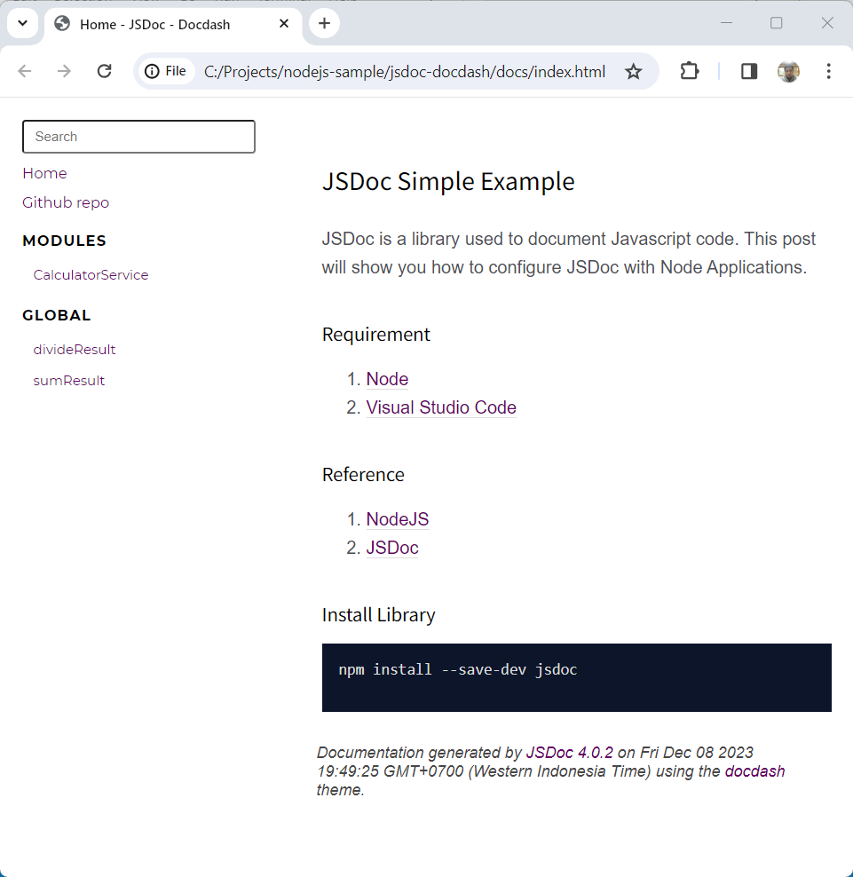
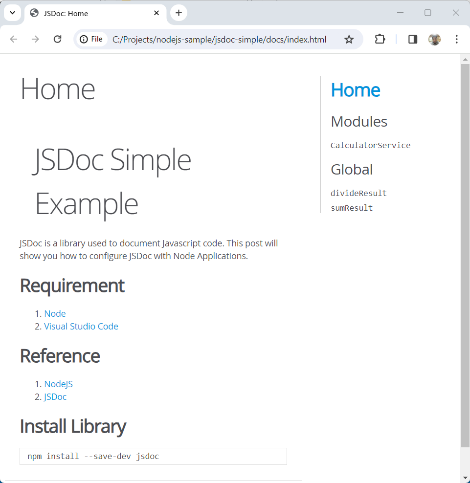

#   Contoh Sederhana JSDoc Dengan Docdash

Anda dapat membuat dokumentasi dengan JSDoc menggunakan template yang telah disediakan atau menggunakan template dari pihak ketiga. ***docdash*** merupakan salah satu template yang dibuat oleh komunitas JSDoc. ***docdash*** adalah tema template dokumentasi yang bersih dan responsif untuk JSDoc 3.

##  Persyaratan

1. 	[Node](https://nodejs.org/en)
1. 	[Visual Studio Code](https://code.visualstudio.com/)

##  Referensi

1.  [NodeJS](https://nodejs.org/api/modules.html)
1.  [JSDoc](https://jsdoc.app/)
1.  [Docdash](https://clenemt.github.io/docdash/)
1.  [rimraf](https://github.com/isaacs/rimraf#readme)

##  Langkah-langkah

1.  Buat aplikasi node

    Lihat postingan ini, [Contoh Sederhana JSDoc](https://marmeam.com/post/jsdoc-simple)

1.  Instal docdash

    ```console
    npm install --save-dev docdash
    ```
1.  Ubah berkas ***jsdoc.json***, dan tambahkan konfigurasi berikut.

    Berkas ini adalah berkas berisi konfigurasi JSDoc, periksa tautan ini https://jsdoc.app/about-configuring-jsdoc

    ```json
    {
        "source": {
            "include": "src",
            "includePattern": ".js$"
        },
        "opts": {
            "template": "node_modules/docdash",
            "destination": "./docs/",
            "readme": "./readme.md",
            "recurse": true
        },
        "docdash": {
            "sort": true,
            "search": true,
            "menu": {
                "Github repo": {
                    "href": "https://github.com/ferrylinton/nodejs-sample/tree/main/jsdoc-crud",
                    "target": "_blank",
                    "class": "menu-item",
                    "id": "repository"
                }
            }
        }
    }
    ```
    Deskripsi :

    -   **"source"** :

        -   **"include"** : "src"
            
            Meng-generate dokumentasi untuk file-file yang ada di dalam folder ***src***

        -   **"includePattern"** : ".js$"

            Meng-generate dokumentasi untuk file-file dengan ekstensi ***.js***

    -   **"opts"** :
        
        -   **"template"** : "node_modules/docdash"

            JSDoc akan menggunakan template ***docdash***

        -   **"destination"** : "./docs/"

            JSDoc akan dibuat di folder ***docs***

        -   **"readme"** : "./README.md"

            Konten ***README.md*** akan ditampilkan di halaman beranda JSDoc

        -   **"recurse"** : true

            Rekursi diaktifkan

    -   **"docdash"** :

        -   **"sort"** : true

            Urutkan menu

        -   **"search"**: true

            Tambahkan bilah pencarian

        -   "**menu**":

            -   **"Github repo"** :

                Menambahkan menu **Repo Github** dengan konfigurasi berikut :

                -   href: https://github.com/ferrylinton/nodejs-sample/tree/main/jsdoc-crud

                -   target: _blank

                -   class: menu-item

                -   id: repository

1.  Meng-generate dokumentasi

    ```console
    npm run doc
    ```
    Buka berkas ***docs\index.html*** untuk melihat dokumentasi yang dihasilkan.

    JSDoc dengan template docdash

    

    JSDoc dengan template asli

    

## Kode

https://github.com/ferrylinton/nodejs-sample/tree/main/jsdoc-docdash