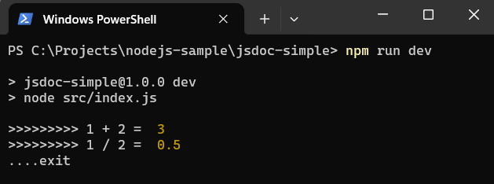
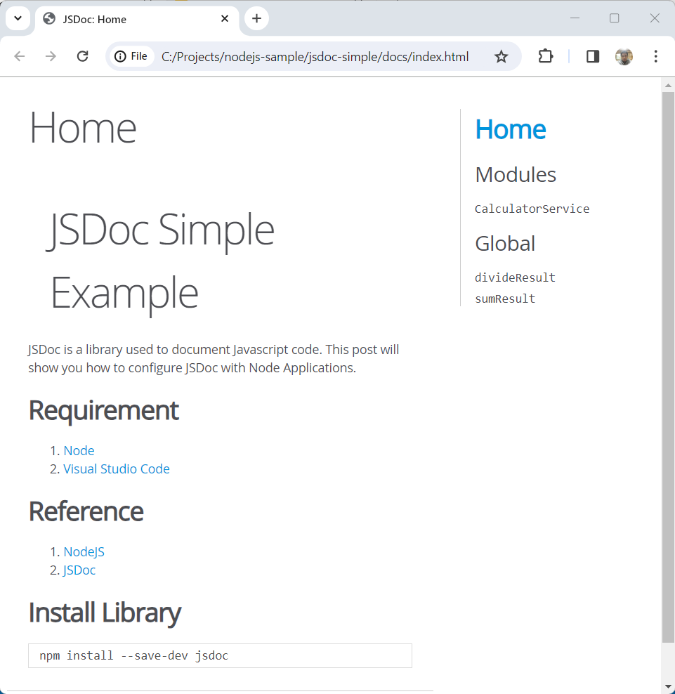

#   Contoh Sederhana JSDoc

JSDoc adalah perpustakaan yang digunakan untuk mendokumentasikan kode Javascript. Posting ini akan menunjukkan cara mengkonfigurasi JSDoc dengan Aplikasi Node.

##  Persyaratan

1. 	[Node](https://nodejs.org/en)
1. 	[Visual Studio Code](https://code.visualstudio.com/)

##  Referensi

1.  [NodeJS](https://nodejs.org/api/modules.html)
1.  [JSDoc](https://jsdoc.app/)
1.  [rimraf](https://github.com/isaacs/rimraf#readme)

##  Langkah-langkah

1.  Buat aplikasi node

    ```console
    npm init -y
    ```
1.  Instal librari

    ```console
    npm install --save-dev jsdoc rimraf
    ```
1.  Buat berkas ***package.json***, dan tambahkan konfigurasi berikut.

    ```json
    {
        "name": "jsdoc-simple",
        "version": "1.0.0",
        "description": "JSDoc Simple Example",
        "main": "src/index.js",
        "scripts": {
            "dev": "node src/index.js",
            "doc": "rimraf docs && jsdoc -c jsdoc.json"
        },
        "keywords": [
            "node",
            "jsdoc"
        ],
        "author": "ferrylinton",
        "license": "ISC",
        "devDependencies": {
            "jsdoc": "^4.0.2",
            "rimraf": "^5.0.5"
        }
    }
    ```

1.  Buat berkas ***jsdoc.json***, dan tambahkan konfigurasi berikut.

    Berkas ini adalah berkas berisi konfigurasi JSDoc, periksa tautan ini https://jsdoc.app/about-configuring-jsdoc

    ```json
    {
        "source": {
            "include": "src",
            "includePattern": ".js$"
        },
        "opts": {
            "template": "node_modules/docdash",
            "destination": "./docs/",
            "readme": "./readme.md",
            "recurse": true
        }
    }
    ```
    Deskripsi:

    -   **"source"** :

        -   **"include"** : "src"
            
            Meng-generate dokumentasi untuk file-file yang ada di dalam folder ***src***

        -   **"includePattern"** : ".js$"

            Meng-generate dokumentasi untuk file-file dengan ekstensi ***.js***

    -   **"opts"** :
        
        -   **"template"** : "node_modules/docdash"

            JSDoc akan menggunakan template ***docdash***

        -   **"destination"** : "./docs/"

            JSDoc akan dibuat di folder ***docs***

        -   **"readme"** : "./README.md"

            Konten ***README.md*** akan ditampilkan di halaman beranda JSDoc

        -   **"recurse"** : true

            Rekursi diaktifkan

1.  Buat berkas ***src\services\calculator-service.js***, dan tambahkan kode berikut.

    Kode ini menunjukkan cara menambahkan dokumentasi di dalam kode.

    ```js
    /**
    * Provides a simple calculation process
    * @module CalculatorService
    */

    /**
    * Sum two numbers
    * @param {number} a - A number to add
    * @param {number} b - A number to add
    * @returns {number} The sum of a and b
    */
    exports.sum = (a, b) => {
        return a + b;
    }

    /**
    * Divides two numbers
    * @param {number} a - The dividend
    * @param {number} b - The divisor
    * @returns {number} The quotient of a and b
    * @throws {Error} If b is zero
    */
    exports.divide = (a, b) => {
        if (b === 0) {
            throw new Error('Cannot divide by zero')
        }
        return a / b
    }
    ```

1.  Buat berkas ***src\index.js***, dan tambahkan kode berikut.

    ```js
    const { sum, divide} = require('./services/calculator-service');

    /**
    * @constant {number}  sumResult - Sum results
    */
    const sumResult = sum(1,2);
    console.log('>>>>>>>>> 1 + 2 = ', sumResult);

    /**
    * @constant {number}  divideResult - Division results
    */
    const divideResult = divide(1,2);
    console.log('>>>>>>>>> 1 / 2 = ', divideResult);
    console.log('....exit\n\n');
    ```
1.  Buat berkas ***README.md***, dan tambahkan konten berikut

    ```md
    # JSDoc Simple Example

    JSDoc is a library used to document Javascript code. This post will show you how to configure JSDoc with Node Applications.

    ## 	Requirement

    1. 	[Node](https://nodejs.org/en)
    1. 	[Visual Studio Code](https://code.visualstudio.com/)

    ## 	Reference

    1.  [NodeJS](https://nodejs.org/api/modules.html)
    1.  [JSDoc](https://jsdoc.app/)

    ## Install Library

        ```console
        npm install --save-dev jsdoc
        ```
    ```

1.  Tes kode

    ```console
    npm run dev
    ```

    Hasil

    

1.  Meng-generate dokumentasi

    ```console
    npm run doc
    ```
    Buka berkas ***docs\index.html*** untuk melihat dokumentasi yang dihasilkan.

    

## Kode

https://github.com/ferrylinton/nodejs-sample/tree/main/jsdoc-simple