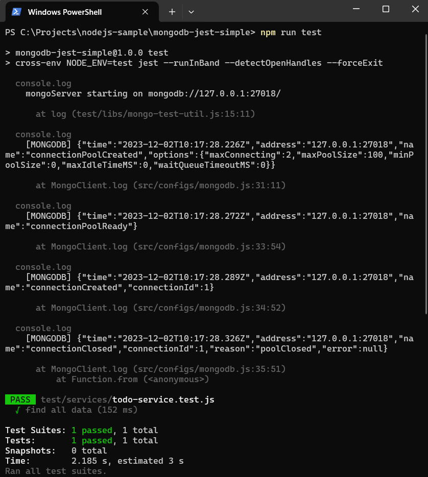

#   Simple Testing With NodeJS, Mongodb and JEST

This post shows how to create a simple unit test using ***NodeJS***, ***JEST*** and ***mongodb-memory-server***. mongodb-memory-server is used for testing or mocking during development and mongodb-memory-server stores data in memory.

## Requirement

1.	[Node](https://nodejs.org/en)
1.	[Mongodb](https://www.mongodb.com/)
1.	[Docker](https://www.docker.com/)
1.	[Visual Studio Code](https://code.visualstudio.com/)

## Reference

1.  [NodeJS](https://nodejs.org/api/modules.html)
1.	[MongoDB Node Driver](https://www.mongodb.com/docs/drivers/node/current/)
1.	[mongodb-memory-server](https://github.com/nodkz/mongodb-memory-server)
1.  [JEST](https://jestjs.io/docs/getting-started)
1.  [dotenv](https://github.com/motdotla/dotenv#readme)

## 	Setup MongoDB with Docker

1.  Start MongoDB in a Docker Container with this script (you can skip this if you already have mongodb installed)

    ```console
    docker run --name local-mongo -p 27017:27017 -e MONGO_INITDB_ROOT_USERNAME=admin -e MONGO_INITDB_ROOT_PASSWORD=password -d mongo:5.0-focal
    ```

    Mongodb configuration:
    -  host : **127.0.0.1**
    -  port: **27017**
    -  username: **admin**
    -  password: **password**

##  Create Node Application

See these posts:

-	[Setup Node Application With Eslint (Common JS)](https://marmeam.com/post/eslint-commonjs-setup)
-	[Setup Node Application With Eslint And Prettier (Common JS)](https://marmeam.com/post/eslint-prettier-commonjs-setup)
-	[Simple Example of JEST](https://marmeam.com/post/jest-simple)
-	[Setup Multiple **.env** Files For Development, Testing And Production](https://marmeam.com/post/mongodb-jest-simple)
-	[Simple Example of Mongodb With NodeJS](https://marmeam.com/post/mongodb-simple)


##  Install Libraries

```console
npm i mongodb
npm i -D  mongodb-memory-server@7.6.3
```

## 	Setup Environment Variables

See this post **[Setup Multiple **.env** Files For Development, Testing And Production](https://marmeam.com/post/mongodb-jest-simple)**

1.	***.env.development*** 

	```
	# MONGODB
	MONGODB_HOST=127.0.0.1
	MONGODB_PORT=27017
	MONGODB_AUTH_SOURCE=admin
	MONGODB_USERNAME=admin
	MONGODB_PASSWORD=password
	MONGODB_DATABASE=blogdb
	```

1.	***.env.production***

	```
	# MONGODB
	MONGODB_HOST=127.0.0.1
	MONGODB_PORT=27017
	MONGODB_AUTH_SOURCE=admin
	MONGODB_USERNAME=admin
	MONGODB_PASSWORD=password
	MONGODB_DATABASE=blogdb
	```

1.	***.env.test***

	```
	# MONGODB
	MONGODB_HOST=127.0.0.1
	MONGODB_PORT=27018
	MONGODB_AUTH_SOURCE=admin
	MONGODB_USERNAME=admin
	MONGODB_PASSWORD=password
	MONGODB_DATABASE=blogdb
	```

1.  Add ***src\configs\env-constant.js*** file, and add the following code.

    ```js
    const fs = require('fs');
    const path = require('path');

    /**
    * Creates a file name based on the NODE_ENV value
    * 1. NODE_ENV=production => .env.production
    * 2. NODE_ENV=development => .env.development
    * 3. NODE_ENV=test => .env.test
    */
    const envFile = path.resolve(process.cwd(), `.env.${process.env.NODE_ENV || ''}`)

    // throw error if envFile is not found
    if (!fs.existsSync(envFile)) {
        throw new Error(`${envFile} is not found`);
    }

    // loads environment variables
    require('dotenv').config({
        path: envFile
    });

    module.exports = {
        MONGODB_HOST: process.env.MONGODB_HOST || '127.0.0.1',
		MONGODB_PORT: process.env.MONGODB_PORT || '27017',
		MONGODB_AUTH_SOURCE: process.env.MONGODB_AUTH_SOURCE,
		MONGODB_USERNAME: process.env.MONGODB_USERNAME,
		MONGODB_PASSWORD: process.env.MONGODB_PASSWORD,
		MONGODB_DATABASE: process.env.MONGODB_DATABASE,
    }
    ```
##	Connect to MongoDB

Add ***mongodb-crud\src\configs\mongodb.js*** and add the following code,

```js
const { MongoClient } = require('mongodb');
const { MONGODB_AUTH_SOURCE, MONGODB_DATABASE, MONGODB_PASSWORD, MONGODB_HOST, MONGODB_PORT, MONGODB_USERNAME } = require('./env-constant');

let mongoClient;

const getMongoClientInstance = () => {

	// MongoDB connection and authentication options.
	// Check this https://www.mongodb.com/docs/drivers/node/current/fundamentals/connection/connection-options/
    const mongoClientOptions = {
        authMechanism: "DEFAULT",
        authSource: MONGODB_AUTH_SOURCE,
        monitorCommands: true,
        auth: {
            username: MONGODB_USERNAME,
            password: MONGODB_PASSWORD
        }
    };

	// Mongodb connection string includes the hostname or IP address and port of your deployment.
	// Check this https://www.mongodb.com/docs/drivers/node/current/quick-start/create-a-connection-string/
    const mongodbURL = `mongodb://${MONGODB_HOST}:${MONGODB_PORT}`;
    const instance = process.env.NODE_ENV === 'test' ? new MongoClient(mongodbURL) : new MongoClient(mongodbURL, mongoClientOptions);
    
	// Record connection pool events in application.
	// Check this https://www.mongodb.com/docs/drivers/node/current/fundamentals/monitoring/connection-monitoring/
    instance.on('connectionPoolCreated', (event) => console.log(`[MONGODB] ${JSON.stringify(event)}`));
    instance.on('connectionPoolReady', (event) => console.log(`[MONGODB] ${JSON.stringify(event)}`));
    instance.on('connectionCreated', (event) => console.log(`[MONGODB] ${JSON.stringify(event)}`));
    instance.on('connectionClosed', (event) => console.log(`[MONGODB] ${JSON.stringify(event)}`));

    return instance;
}

const getMongoClient = async () => {
    if (mongoClient === null || mongoClient === undefined) {
        try {
            mongoClient = getMongoClientInstance().connect();
        } catch (error) {
            mongoClient = null;
            console.log(error);
        }

        return mongoClient;
    }

    return mongoClient;
}

const getCollection = async (name) => {
    const connection = await getMongoClient();

    if (connection) {
        const db = connection.db(MONGODB_DATABASE);
        return db.collection(name);
    } else {
        throw new Error('No mongodb connection');
    }

}

module.exports = {
    getMongoClient,
    getCollection
};
```
##  Add Simple Code

1.  Add ***src\services\todo-service.js*** file, and add the following code.

    ```js
    const { getCollection } = require('../configs/mongodb');

    const TODO_COLLECTION = 'todo';

    const find = async () => {
        const todoCollection = await getCollection(TODO_COLLECTION);
        return todoCollection.find().toArray();
    };

    module.exports = {
        find,
    };
    ```

1.  Add ***src\index.js*** file, and add the following code.

    This file will be called to run the application.

    ```js
    const todoServcie = require('./services/todo-service');

    async function run() {
        const todoes = await todoServcie.find();
        console.log('>>> todoService.find()');
        console.log(todoes);
    }

    function close() {
        setTimeout(function () {
            process.exit();
        }, 1000);
    }

    run().catch(console.dir).finally(close);
    ```

1.  Add ***test\libs\mongo-test-util.js*** file, and add the following code.

    ```js
    const { MONGODB_DATABASE, MONGODB_PORT } = require('../../src/configs/env-constant');
    const { MongoMemoryServer } = require('mongodb-memory-server');
    const { getMongoClient } = require('../../src/configs/mongodb');

    const mongoServer = new MongoMemoryServer({
        instance: {
            port: parseInt(MONGODB_PORT),
            dbName: MONGODB_DATABASE,
        },
    });

    const startMongoServer = async () => {
        try {
            await mongoServer.start(true);
            console.log(`mongoServer starting on ${mongoServer.getUri()}`);
        } catch (error) {
            console.log(error);
        }
    };

    const stopMongoServer = async () => {
        try {
            const connection = await getMongoClient();
            if (connection) {
                connection.close();
            }

            await mongoServer.stop();
        } catch (error) {
            console.log(error);
        }
    };

    module.exports = {
        startMongoServer,
        stopMongoServer,
    };

    ```

1.  Add ***test\services\todo-service.test.js*** file, and add the following code.

    ```js
    const todoService = require('../../src/services/todo-service');
    const assert = require('assert');
    const { startMongoServer, stopMongoServer } = require('../libs/mongo-test-util');

    beforeAll(async () => {
        await startMongoServer();
    });

    afterAll(async () => {
        await stopMongoServer();
    });

    test('find all data', async () => {
        const todoes = await todoService.find();
        assert.strictEqual(todoes.length, 0);
    });
    ```
1.  Modify ***package.json*** file, and add the following code.

    ```json
    {
        "name": "mongodb-jest-simple",
        "version": "1.0.0",
        "description": "Simple Testing With NodeJS, Mongodb and JEST",
        "main": " src/index.js",
        "scripts": {
            "start": "cross-env NODE_ENV=production node src/index.js",
            "dev": "cross-env NODE_ENV=development node src/index.js",
            "test": "cross-env NODE_ENV=test jest --runInBand --detectOpenHandles --forceExit",
            "lint": "eslint .",
            "lint:fix": "eslint . --fix",
            "format": "prettier . --write",
            "format:check": "prettier . --check"
        },
        "keywords": [
            "node",
            "mongodb",
            "eslint",
            "jest"
        ],
        "author": "ferrylinton",
        "license": "ISC",
        "devDependencies": {
            "eslint": "^8.54.0",
            "eslint-config-prettier": "^9.0.0",
            "eslint-config-standard": "^17.1.0",
            "eslint-plugin-import": "^2.29.0",
            "eslint-plugin-jest": "^27.6.0",
            "eslint-plugin-n": "^16.3.1",
            "eslint-plugin-prettier": "^5.0.1",
            "eslint-plugin-promise": "^6.1.1",
            "jest": "^29.7.0",
            "mongodb-memory-server": "^7.6.3",
            "prettier": "3.1.0"
        },
        "dependencies": {
            "cross-env": "^7.0.3",
            "dotenv": "^16.3.1",
            "mongodb": "^6.3.0"
        }
    }
    ```

1.  Run application on test mode.

    ```console
    npm test
    ```
    
    

## Source Code

https://github.com/ferrylinton/nodejs-sample/tree/main/mongodb-jest-simple
