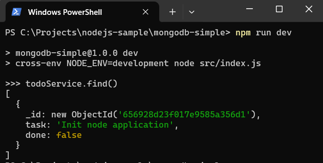
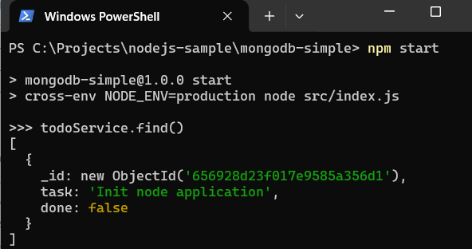

#   Contoh Sederhana Mongodb Dengan NodeJS

Posting ini menunjukkan cara menyiapkan aplikasi node yang menggunakan driver MongoDB Node.js untuk terhubung ke MongoDB. Memuat kode untuk terhubung ke MongoDB dan buat fungsi untuk query data.

##  Persyaratan

1.	[Node](https://nodejs.org/en)
1.	[Mongodb](https://www.mongodb.com/)
1.	[Docker](https://www.docker.com/)
1.	[Visual Studio Code](https://code.visualstudio.com/)

##  Referensi

1.  [NodeJS](https://nodejs.org/api/modules.html)
1.	[MongoDB Node Driver](https://www.mongodb.com/docs/drivers/node/current/)
1.  [dotenv](https://github.com/motdotla/dotenv#readme)

## 	Siapkan MongoDB dengan Docker

1.  Mulai MongoDB di Docker Container dengan skrip ini (Anda dapat melewati ini jika Anda sudah menginstal mongodb)

    ```console
    docker run --name local-mongo -p 27017:27017 -e MONGO_INITDB_ROOT_USERNAME=admin -e MONGO_INITDB_ROOT_PASSWORD=password -d mongo:5.0-focal
    ```

    Konfigurasi Mongodb:
    -  host : **127.0.0.1**
    -  port: **27017**
    -  username: **admin**
    -  password: **password**
    
##  Buat Aplikasi Node

Lihat postingan berikut:

-   [Mempersiapkan Aplikasi Node Dengan Eslint (Common JS)](https://marmeam.com/post/eslint-commonjs-setup)
-   [Mempersiapkan Aplikasi Node Dengan Eslint dan Prettier (Common JS)](https://marmeam.com/post/eslint-prettier-commonjs-setup)
-	[Contoh Sederhana JEST](https://marmeam.com/post/jest-simple)
-	[Menyiapkan Beberapa Berkas **.env** Untuk Pengembangan, Pengujian, dan Produksi](https://marmeam.com/post/multi-env-files)

##  Instal Librari

```console
npm i mongodb
```
## 	Mempersiapkan Variabel Lingkungan

1.	Buat berkas ***.env.development***, dan tambahkan konfigurasi berikut

	```
	# MONGODB
	MONGODB_HOST=127.0.0.1
	MONGODB_PORT=27017
	MONGODB_AUTH_SOURCE=admin
	MONGODB_USERNAME=admin
	MONGODB_PASSWORD=password
	MONGODB_DATABASE=blogdb
	```

1.	Buat berkas ***.env.production***, dan tambahkan konfigurasi berikut

	```
	# MONGODB
	MONGODB_HOST=127.0.0.1
	MONGODB_PORT=27017
	MONGODB_AUTH_SOURCE=admin
	MONGODB_USERNAME=admin
	MONGODB_PASSWORD=password
	MONGODB_DATABASE=blogdb
	```

1.  Buat berkas ***src\configs\env-constant.js***, dan tambahkan kode berikut

    ```js
    const fs = require('fs');
    const path = require('path');

    /**
    * Membuat nama file berdasarkan nilai NODE_ENV
    * 1. NODE_ENV=production => .env.production
    * 2. NODE_ENV=development => .env.development
    * 3. NODE_ENV=test => .env.test
    */
    const envFile = path.resolve(process.cwd(), `.env.${process.env.NODE_ENV || ''}`)

    // throw error jika berkas envFile tidak ditemukan
    if (!fs.existsSync(envFile)) {
        throw new Error(`${envFile} is not found`);
    }

    // memuat variabel lingkungan
    require('dotenv').config({
        path: envFile
    });

    module.exports = {
        MONGODB_HOST: process.env.MONGODB_HOST || '127.0.0.1',
		MONGODB_PORT: process.env.MONGODB_PORT || '27017',
		MONGODB_AUTH_SOURCE: process.env.MONGODB_AUTH_SOURCE,
		MONGODB_USERNAME: process.env.MONGODB_USERNAME,
		MONGODB_PASSWORD: process.env.MONGODB_PASSWORD,
		MONGODB_DATABASE: process.env.MONGODB_DATABASE,
    }
    ```
##	Membuat Koneksi Ke MongoDB

Buat berkas ***src\configs\mongodb.js***, dan tambahkan kode berikut

```js
const { MongoClient } = require('mongodb');
const { MONGODB_AUTH_SOURCE, MONGODB_DATABASE, MONGODB_PASSWORD, MONGODB_HOST, MONGODB_PORT, MONGODB_USERNAME } = require('./env-constant');

let mongoClient;

const getMongoClientInstance = () => {

	// MongoDB connection and authentication options.
	// Check this https://www.mongodb.com/docs/drivers/node/current/fundamentals/connection/connection-options/
    const mongoClientOptions = {
        authMechanism: "DEFAULT",
        authSource: MONGODB_AUTH_SOURCE,
        monitorCommands: true,
        auth: {
            username: MONGODB_USERNAME,
            password: MONGODB_PASSWORD
        }
    };

	// Mongodb connection string includes the hostname or IP address and port of your deployment.
	// Check this https://www.mongodb.com/docs/drivers/node/current/quick-start/create-a-connection-string/
    const mongodbURL = `mongodb://${MONGODB_HOST}:${MONGODB_PORT}`;
    const instance = process.env.NODE_ENV === 'test' ? new MongoClient(mongodbURL) : new MongoClient(mongodbURL, mongoClientOptions);
    
	// Record connection pool events in application.
	// Check this https://www.mongodb.com/docs/drivers/node/current/fundamentals/monitoring/connection-monitoring/
    instance.on('connectionPoolCreated', (event) => console.log(`[MONGODB] ${JSON.stringify(event)}`));
    instance.on('connectionPoolReady', (event) => console.log(`[MONGODB] ${JSON.stringify(event)}`));
    instance.on('connectionCreated', (event) => console.log(`[MONGODB] ${JSON.stringify(event)}`));
    instance.on('connectionClosed', (event) => console.log(`[MONGODB] ${JSON.stringify(event)}`));

    return instance;
}

const getMongoClient = async () => {
    if (mongoClient === null || mongoClient === undefined) {
        try {
            mongoClient = getMongoClientInstance().connect();
        } catch (error) {
            mongoClient = null;
            console.log(error);
        }

        return mongoClient;
    }

    return mongoClient;
}

const getCollection = async (name) => {
    const connection = await getMongoClient();

    if (connection) {
        const db = connection.db(MONGODB_DATABASE);
        return db.collection(name);
    } else {
        throw new Error('No mongodb connection');
    }

}

module.exports = {
    getMongoClient,
    getCollection
};
```    
##  Buat Kode Sederhana

1.  Buat berkas ***src\services\todo-service.js***, dan tambahkan kode berikut.

    ```js
    const { getCollection } = require('../configs/mongodb');

    const TODO_COLLECTION = 'todo';

    const find = async () => {
        const todoCollection = await getCollection(TODO_COLLECTION);
        return todoCollection.find().toArray();
    };

    module.exports = {
        find,
    };
    ```

1.  Buat berkas ***src\index.js***, dan tambahkan kode berikut

    Berkas ini akan dipanggil untuk menjalankan aplikasi.

    ```js
    const todoServcie = require('./services/todo-service');

    async function run() {
        const todoes = await todoServcie.find();
        console.log('>>> todoService.find()');
        console.log(todoes);
    }

    function close() {
        setTimeout(function () {
            process.exit();
        }, 1000);
    }

    run().catch(console.dir).finally(close);
    ```


1.  Ubah berkas ***package.json***, dan tambahkan konfigurasi berikut

    ```json
    {
        "name": "mongodb-simple",
        "version": "1.0.0",
        "description": "Simple Example of Mongodb With NodeJS",
        "main": " src/index.js",
        "scripts": {
            "start": "cross-env NODE_ENV=production node src/index.js",
            "dev": "cross-env NODE_ENV=development node src/index.js",
            "test": "cross-env NODE_ENV=test jest",
            "lint": "eslint .",
            "lint:fix": "eslint . --fix",
            "format": "prettier . --write",
            "format:check": "prettier . --check"
        },
        "keywords": [
            "node",
            "mongodb",
            "eslint"
        ],
        "author": "ferrylinton",
        "license": "ISC",
        "dependencies": {
            "cross-env": "^7.0.3",
            "dotenv": "^16.3.1",
            "mongodb": "^6.3.0"
        },
        "devDependencies": {
            "eslint": "^8.54.0",
            "eslint-config-prettier": "^9.0.0",
            "eslint-config-standard": "^17.1.0",
            "eslint-plugin-import": "^2.29.0",
            "eslint-plugin-jest": "^27.6.0",
            "eslint-plugin-n": "^16.3.1",
            "eslint-plugin-prettier": "^5.0.1",
            "eslint-plugin-promise": "^6.1.1",
            "jest": "^29.7.0",
            "prettier": "3.1.0"
        }
    }
    ```

1.  Jalankan skrip

    -   Menjalankan aplikasi di mode pengembangan.

        ```console
        npm run dev
        ```
        

    -   Menjalankan aplikasi di mode produksi.

        ```console
        npm start
        ```
        


## Kode

https://github.com/ferrylinton/nodejs-sample/tree/main/mongodb-simple
