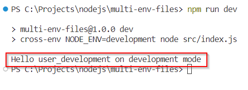
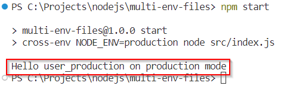
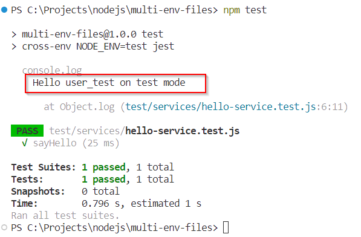

# Setup Multiple **.env** Files For Development, Testing And Production

When building an application, it is likely that we will have to provide several different configurations for development, test, and production environments. This post will show you how to create some configurations for multiple env files using dotenv.

## Requirement

1. [Node](https://nodejs.org/en)
1. [Node - Test](https://nodejs.org/api/test.html)
1. [Visual Studio Code](https://code.visualstudio.com/)

## Reference

1.  [NodeJS](https://nodejs.org/api/modules.html)
1.  [Jest](https://jestjs.io/docs/getting-started)
1.  [dotenv](https://github.com/motdotla/dotenv#readme)

##  Create Node Application

See these posts:

-	[Setup Node Application With Eslint (Common JS)](https://marmeam.com/post/eslint-commonjs-setup)
-	[Setup Node Application With Eslint And Prettier (Common JS)](https://marmeam.com/post/eslint-prettier-commonjs-setup)
-	[Simple Example of JEST](https://marmeam.com/post/jest-simple)

## Steps

1.  Install dotenv and cross-env

    ```console
    npm install dotenv cross-env
    ```

1.  Add ***src\configs\env-constant.js*** file, and add the following code.

    ```js
    const fs = require('fs');
    const path = require('path');

    /**
    * Creates a file name based on the NODE_ENV value
    * 1. NODE_ENV=production => .env.production
    * 2. NODE_ENV=development => .env.development
    * 3. NODE_ENV=test => .env.test
    */
    const envFile = path.resolve(process.cwd(), `.env.${process.env.NODE_ENV || ''}`)

    // throw error if envFile is not found
    if (!fs.existsSync(envFile)) {
        throw new Error(`${envFile} is not found`);
    }

    // loads environment variables
    require('dotenv').config({
        path: envFile
    });

    module.exports = {
        NODE_ENV: process.env.NODE_ENV || 'development',
        APP_USERNAME: process.env.APP_USERNAME
    }
    ```
1.  Add ***src\services\hello-service.js*** file, and add the following code.

    This code is a simple hello function.

    ```js
    const { APP_USERNAME, NODE_ENV } = require("../configs/env-constant");

    function sayHello() {
        // this code will show variables from .env file
        return `Hello ${APP_USERNAME} on ${NODE_ENV} mode`;
    }

    module.exports = {
        sayHello
    };
    ```

1.  Add ***src\index.js*** file, and add the following code.

    This file is called to run the application.

    ```js
    const { sayHello } = require('./services/hello-service');

    // call sayHello function, and print the result
    const result = sayHello();
    console.log(result);
    ```

1.  Add ***test\services\hello-service.test.js*** file, and add the following code.

    ```js
    const { sayHello } = require('../../src/services/hello-service');

    test('sayHello', () => { 

    const result = sayHello(); 
    console.log(result);
    expect(result).toBe('Hello user_test on test mode');
            
    });
    ```
1.  Modify ***package.json*** file.

    ```json
    {
        "name": "multi-env-files",
        "version": "1.0.0",
        "description": "Setup Multiple .env Files For Development, Testing And Production",
        "main": " src/index.js",
        "scripts": {
            "start": "cross-env NODE_ENV=production node src/index.js",
            "dev": "cross-env NODE_ENV=development node src/index.js",
            "test": "cross-env NODE_ENV=test jest",
            "lint": "eslint .",
            "lint:fix": "eslint . --fix",
            "format": "prettier . --write",
            "format:check": "prettier . --check"
        },
        "keywords": [
            "node",
            "eslint",
            "prettier",
            "jest"
        ],
        "author": "ferrylinton",
        "license": "ISC",
        "dependencies": {
            "cross-env": "^7.0.3",
            "dotenv": "^16.3.1"
        },
        "devDependencies": {
            "eslint": "^8.54.0",
            "eslint-config-prettier": "^9.0.0",
            "eslint-config-standard": "^17.1.0",
            "eslint-plugin-import": "^2.29.0",
            "eslint-plugin-jest": "^27.6.0",
            "eslint-plugin-n": "^16.3.1",
            "eslint-plugin-prettier": "^5.0.1",
            "eslint-plugin-promise": "^6.1.1",
            "jest": "^29.7.0",
            "prettier": "3.1.0"
        }
    }
    ```

1.  Add ***.env*** files

    -   Add ***.env.development*** file (development mode), and add this variable

        ```
        APP_USERNAME=user_development
        ```
    -   Add ***.env.production*** file (production mode), and add this variable

        ```
        APP_USERNAME=user_production
        ```
    -   Add ***.env.test*** file (test mode), and add this variable

        ```
        APP_USERNAME=user_test
        ```

1.  Run scripts.

    -   Run application on development mode.

        ```console
        npm run dev
        ```
        

    -   Run application on production mode.

        ```console
        npm start
        ```
        

    -   Run application on test mode.

        ```console
        npm test
        ```
        
    

## Source Code

https://github.com/ferrylinton/nodejs-sample/tree/main/multi-env-files
