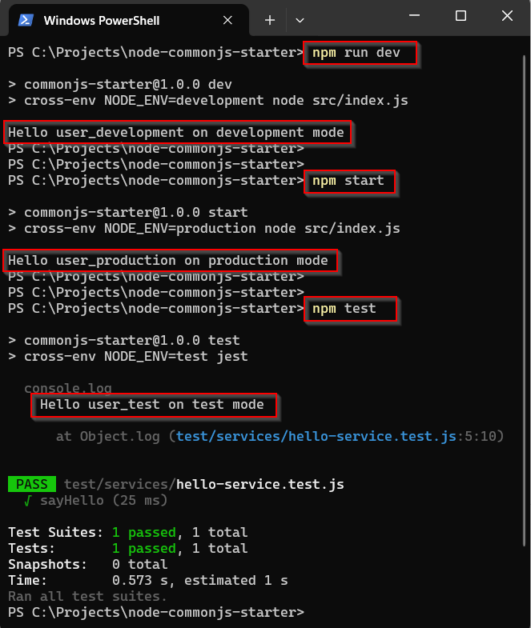
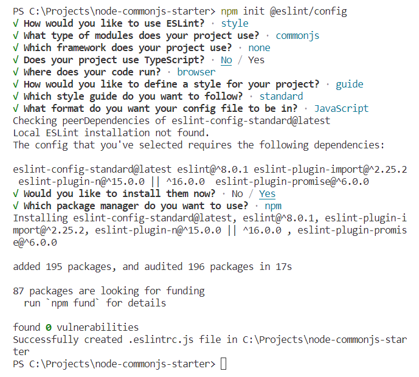

# 	Setup Development Environment For Node JS with CommonJS

This post will explain how to set up a development environment for Node JS with CommonJS (not a web application). Prepare simple configurations for tools and libraries that will be used in application development such as JEST, ESLint, Prettier, Husky, and Lint-staged.

## 	Requirement

1. 	[Node](https://nodejs.org/en)
1. 	[Visual Studio Code](https://code.visualstudio.com/)

## 	Reference

1.  [NodeJS](https://nodejs.org/api/modules.html)
1.  [JEST](https://jestjs.io/docs/getting-started)
1.  [ESLint](https://eslint.org/docs/latest/use/getting-started)
1.  [Prettier](https://prettier.io/docs/en/)
1.  [Husky](https://typicode.github.io/husky/getting-started.html)
1.  [lint-staged](https://github.com/lint-staged/lint-staged#readme)

## 	Create Simple Node Application

1.  Create folder ***node-commonjs-starter*** (or your project name)

	```console
	mkdir node-commonjs-starter
	cd node-commonjs-starter
	```

1.	Initialize git

	```console
	git init
	git branch -M main
  	git remote add origin ***your_repository_url***
	```

1.	Initialize node application

	```console
	npm init --yes
	```

1.  Open generated code with Visual Studio Code.

    ```console
    code .
    ```

## Setup Environment Variables

1.	Install ***cross-env*** and ***dotenv***

	-	**[cross-env](https://www.npmjs.com/package/cross-env)** set cross-platform environment variables with the same command. 
	-	**[dotenv](https://www.npmjs.com/package/dotenv)** loads environment variables from a .env file into process.env.

		```console
		npm i cross-env dotenv
		``` 

1.	Create these files and add the variable

	-	***.env.development*** 

		```
		APP_USERNAME=user_development
		```

	- 	***.env.production***

		```
		APP_USERNAME=user_production
		```

	- 	***.env.test***

		```
		APP_USERNAME=user_test
		```

1.  Add ***src\configs\env-constant.js*** file, and add the following code.

    ```js
    const fs = require('fs');
    const path = require('path');

    /**
    * Creates a file name based on the NODE_ENV value
    * 1. NODE_ENV=production => .env.production
    * 2. NODE_ENV=development => .env.development
    * 3. NODE_ENV=test => .env.test
    */
    const envFile = path.resolve(process.cwd(), `.env.${process.env.NODE_ENV || ''}`)

    // throw error if envFile is not found
    if (!fs.existsSync(envFile)) {
        throw new Error(`${envFile} is not found`);
    }

    // loads environment variables
    require('dotenv').config({
        path: envFile
    });

    module.exports = {
        NODE_ENV: process.env.NODE_ENV || 'development',
        APP_USERNAME: process.env.APP_USERNAME
    }
    ```

## Add Simple Code

1.  Add ***src\services\hello-service.js*** file, and add the following code.

    This code is a simple hello function.

    ```js
    const { APP_USERNAME, NODE_ENV } = require("../configs/env-constant");

    function sayHello() {
        // this code will show variables from .env file
        return `Hello ${APP_USERNAME} on ${NODE_ENV} mode`;
    }

    module.exports = {
        sayHello
    };
    ```

1.  Add ***src\index.js*** file, and add the following code.

    This file will be called to run the application.

    ```js
    const { sayHello } = require('./services/hello-service');

    // call sayHello function, and print the result
    const result = sayHello();
    console.log(result);
    ```

1.  Add ***test\services\hello-service.test.js*** file, and add the following code.

    ```js
    const { sayHello } = require('../../src/services/hello-service');

    test('sayHello', () => { 

		const result = sayHello(); 
		console.log(result);
		expect(result).toBe('Hello user_test on test mode');
            
    });
    ```

1.	Modify ***package.json*** and add this scripts

	```
	...
	"start": "cross-env NODE_ENV=production node src/index.js",
	"dev": "cross-env NODE_ENV=development node src/index.js",
	"test": "cross-env NODE_ENV=test jest",
	...

	```
1.  Test code by running these scripts. 

    -   Run application on development mode.

        ```console
        npm run dev
        ```

    -   Run application on production mode.

        ```console
        npm start
        ```

    -   Run application on test mode.

        ```console
        npm test
        ```
        

## 	Setup ESLint

1.  Initialize ESLint

    ```console
    npm init @eslint/config
    ```
	Choose this configuration

    

1.	Install ***Jest***

	```console
	npm install --save-dev jest eslint-plugin-jest
	```

1.  Install ***Prettier***

    ```console
    npm install --save-dev --save-exact prettier
    npm install --save-dev eslint-plugin-prettier eslint-config-prettier
    ```

1.	Create ***.prettierrc.json*** file, and add this configuration.

    ```json
    {
		"trailingComma": "es5",
		"tabWidth": 4,
		"useTabs": true,
		"printWidth": 100,
		"semi": true,
		"singleQuote": true,
		"quoteProps": "consistent",
		"arrowParens": "avoid"
	}
    ```

1.	Create ***.prettierignore*** file, and add this text.

    ```
    # Ignore artifacts:
	build
	coverage

	# Ignore all HTML files:
	**/*.html

	package-lock.json
    ```

1.  Modify ***.eslintrc.js*** file, and add this configuration.

    ```js
    module.exports = {
		env: {
			commonjs: true,
			node: true,
			es6: true,
			jest: true,
		},
		extends: ['plugin:prettier/recommended', 'prettier', 'eslint:recommended'],
		overrides: [
			{
				files: ['.eslintrc.{js,cjs}', '**/*.test.js'],
				parserOptions: {
					sourceType: 'script',
				},
				plugins: ['jest'],
			},
		],
		parserOptions: {
			ecmaVersion: 'latest',
		},
		rules: {
			'prettier/prettier': 'warn',
			'no-unused-vars': 'warn',
			'no-var': 'warn',
			'prefer-const': 'warn',
		},
	};
    ```

## Setup Husky

1.  Initialize the husky pre-commit script

    ```console
    npx husky-init
    ```

1.  Modify ***.husky\pre-commit*** file, and add the following code.

    ```
    #!/usr/bin/env sh
    . "$(dirname -- "$0")/_/husky.sh"

    npx lint-staged
    ```

1.  Install ***lint-staged***

    ```console
    npm install --save-dev lint-staged
    ```


## Test Project Configuration

1.  Modify ***package.json*** file and add this code.

    ```json
    {
		"name": "commonjs-starter",
		"version": "1.0.0",
		"description": "Node (CommonJS) boilerplate project",
		"main": " src/index.js",
		"repository": {
			"type": "git",
			"url": "git+https://github.com/ferrylinton/node-commonjs-starter.git"
		},
		"keywords": [
			"node",
			"commonjs",
			"eslint",
			"prettier",
			"husky"
		],
		"author": "Ferry L. H.",
		"license": "ISC",
		"bugs": {
			"url": "https://github.com/ferrylinton/node-commonjs-starter/issues"
		},
		"homepage": "https://github.com/ferrylinton/node-commonjs-starter#readme",
		"scripts": {
			"dev": "node src/index.js",
			"lint": "eslint .",
			"lint:fix": "eslint --fix .",
			"format": "prettier . --write",
			"prepare": "husky install"
		},
		"husky": {
			"hooks": {
				"pre-commit": "lint-staged"
			}
		},
		"lint-staged": {
			"**/*.js": [
				"npm run lint:fix",
				"npm run format"
			]
		},
		"devDependencies": {
			"eslint": "^8.54.0",
			"eslint-config-prettier": "^9.0.0",
			"eslint-config-standard": "^17.1.0",
			"eslint-plugin-import": "^2.29.0",
			"eslint-plugin-jest": "^27.6.0",
			"eslint-plugin-n": "^16.3.1",
			"eslint-plugin-prettier": "^5.0.1",
			"eslint-plugin-promise": "^6.1.1",
			"husky": "^8.0.0",
			"jest": "^29.7.0",
			"lint-staged": "^15.1.0",
			"prettier": "3.1.0"
		}
	}
    ```

1. Test all configurations by executing **git commit**

	```console
	git add .
	git commit -m "test lint-stage"
	```
	These messages will be shown if the configuration is working

	```
	[STARTED] Preparing lint-staged...
	[COMPLETED] Preparing lint-staged...
	[STARTED] Running tasks for staged files...
	[STARTED] package.json — 2 files
	[STARTED] **/*.js — 1 file
	[STARTED] npm run lint:fix
	[COMPLETED] npm run lint:fix
	[STARTED] npm run format
	[COMPLETED] npm run format
	[COMPLETED] **/*.js — 1 file
	[COMPLETED] package.json — 2 files
	[COMPLETED] Running tasks for staged files...
	[STARTED] Applying modifications from tasks...
	[COMPLETED] Applying modifications from tasks...
	[STARTED] Cleaning up temporary files...
	[COMPLETED] Cleaning up temporary files...
	[main 8ce8a5e] test lint-stage
	```
	**Note**
	- 	If this message appears in the console
		```console
		Skipping backup because there’s no initial commit yet.
		```
		Run this script
		```
		git commit --no-verify --allow-empty -m "initial commit"
		```

  	- 	If this message appears in the console

		```console
		fatal: cannot run .husky/pre-commit: No such file or directory
		```
    	Delete ***.husky*** folder, and run this script.

		```console
		npx husky-init
		```
		Modify ***.husky\pre-commit*** file, and add the following code.
		```
		#!/usr/bin/env sh
		. "$(dirname -- "$0")/_/husky.sh"

		npx lint-staged
		```

	- 	If this messages appear in the console
		```console
		warning: in the working copy of '.eslintrc.js', LF will be replaced by CRLF the next time Git touches it
		warning: in the working copy of '.husky/pre-commit', LF will be replaced by CRLF the next time Git touches it
		warning: in the working copy of '.prettierrc.json', LF will be replaced by CRLF the next time Git touches it
		warning: in the working copy of 'package-lock.json', LF will be replaced by CRLF the next time Git touches it
		warning: in the working copy of 'package.json', LF will be replaced by CRLF the next time Git touches it
		```
    	Run this script or just ignore it

		```console
		git config --local core.autocrlf false
		```

## Source Code

https://github.com/ferrylinton/node-commonjs-starter

